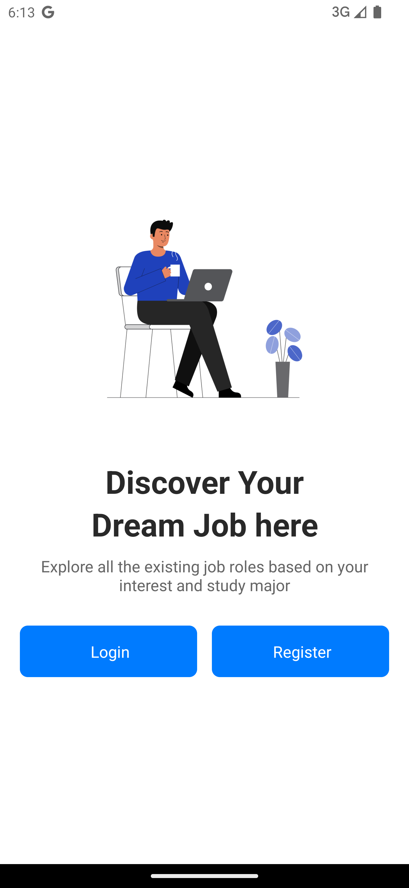
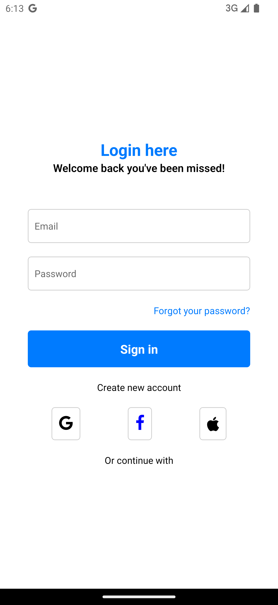
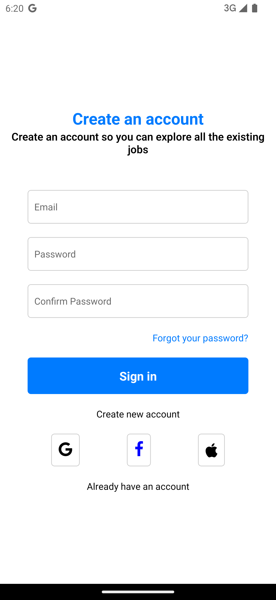

# JOb Application App

## Description
A brief description of your project.

**Screens**  
- HomePage  
- Login Screen 
- Register Screen

## Technologies Used
##  React Bative Expo

## Installation

 **Start the application:**
    ```bash
    npx expo start
    ```

## Screenshots

**Home Page**  


**Login Page**  


**Register Page**  

## License
This project is licensed under the MIT License.
